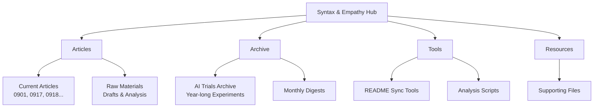

# Syntax & Empathy

*A research hub exploring AI, technology, and human creativity through experimental articles and analysis.*

## Project Overview



This is a Quarto-based website that documents experiments and insights at the intersection of artificial intelligence and human creativity. The project serves as both a research repository and a publication platform for articles exploring how AI tools affect writing, analysis, and creative processes.

## Quick Start

**For Website Visitors:**
1. Browse published articles at the [live site](https://syntax-and-empathy.github.io/s-and-e-hub)
2. Use the search and filter tools to find topics of interest
3. Check the Resources section for supporting materials

**For Researchers and Contributors:**
1. **Prerequisites**: Python 3.10+, Quarto CLI
2. **Setup**: `pip install jupyter ipykernel` (or use `uv` for faster package management)
3. **Development**: `quarto preview` to serve locally
4. **Publishing**: `quarto publish gh-pages` to deploy

## Project Structure

### Core Directories

| Directory | Purpose | Key Contents |
|-----------|---------|--------------|
| **`/articles`** | Current research articles and supporting materials | Dated article series (0901, 0917, 0918...), raw drafts, analysis files |
| **`/archive`** | Historical AI content generation experiments | Year-long AI trials archive, monthly/quarterly digests |
| **`/tools`** | Automation and analysis utilities | README sync tools, Python scripts for text analysis |
| **`/resources`** | Supporting project files | Static assets, reference materials |

### Article Organization

Articles follow a systematic naming convention: `MMDD-descriptive-name/`

Each article directory typically contains:
- **Numbered drafts** (01-, 02-, 03-...) showing iterative development
- **`/raw`** subdirectory with working materials
- **Supporting files**: Python scripts, analysis results, images
- **Research artifacts**: Transcripts, data exports, charts

Example structure:
```
articles/0901-count-that-couldnt/
├── raw/01-04-the-count-that-coudnt.md    # Draft progression
├── images/                                # Article assets
├── script-test-1,2,3/                    # Analysis experiments
├── *.py                                   # Analysis scripts
└── *.md                                   # Research notes
```

## Research Focus Areas

- **AI Writing Analysis**: Tools and methods for measuring AI vs. human contribution in text
- **Multi-modal Insights**: Exploring visual, audio, and text combinations in AI workflows
- **Algorithmic Theatre**: Examining the performative aspects of human-AI collaboration
- **Authenticity Studies**: Investigating genuine vs. artificial expression in AI-assisted work

## Navigation Guide

### For Technical Users
- **Start here**: Browse `/articles` for current research
- **Deep dive**: Explore `/articles/raw` for detailed analysis materials
- **Historical context**: Review `/archive` for evolution of AI experiments
- **Replication**: Use Python scripts in article directories for analysis reproduction

### For Academic Researchers
- **Methodology**: Each article documents experimental approach and tools used
- **Data availability**: Raw analysis results preserved in CSV/JSON formats
- **Reproducibility**: Jupyter notebooks and Python scripts included where applicable
- **Literature**: Cross-references and AI model comparisons throughout

### For AI Practitioners
- **Prompt engineering**: Examples throughout archived AI trials
- **Tool evaluation**: Comparative analysis of different AI models and approaches
- **Workflow insights**: Real-world examples of human-AI collaboration challenges
- **Failure documentation**: Honest reporting of unsuccessful experiments and debugging

## Technical Architecture

**Publishing Platform**: Quarto (R/Python scientific publishing)
**Site Generation**: Static site with dynamic listing and search
**Content Format**: Markdown with YAML front matter
**Analysis Tools**: Python (pandas, scikit-learn, matplotlib)
**Hosting**: GitHub Pages

The site automatically generates article listings, search functionality, and navigation from the directory structure and article metadata.

## Recent Updates

- **September 2025**: Added multi-modal visual analysis articles
- **August 2025**: Implemented algorithmic theatre research series
- **Ongoing**: README standardization and documentation improvements

## Contributing

This project documents ongoing research. While not actively seeking contributions, the methodology and tools are designed to be replicable and extensible.

**If replicating analysis:**
1. Note Python dependencies in individual article directories
2. Jupyter notebooks designed for Google Colab when specified
3. Analysis scripts expect specific file naming conventions

## License

Content licensed under [CC BY 4.0](https://creativecommons.org/licenses/by/4.0/) - freely reusable with attribution.

---

*Last updated: 2025-09-20*
