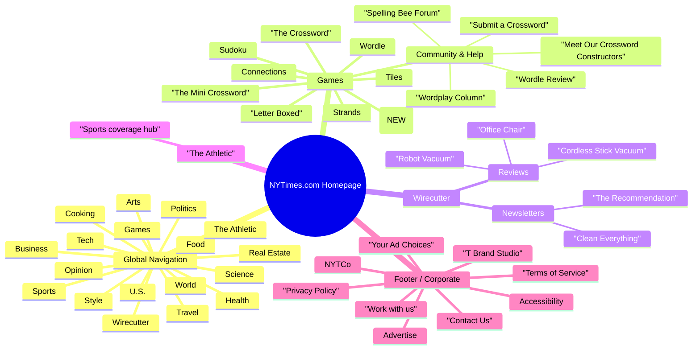

# Information architecture NYT

**User:** Anonymous (wtrekell@gmail.com)  
**Created:** 9/13/2025 20:23:35  
**Updated:** 9/14/2025 13:44:31  
**Exported:** 9/14/2025 13:44:52  
**Link:** [https://chatgpt.com/c/68c63537-130c-8329-a2c6-6ca9da0ef4d0](https://chatgpt.com/c/68c63537-130c-8329-a2c6-6ca9da0ef4d0)  

## Prompt:
Document the information architecture of the New York Times homepage.

## Response:
Here’s a structured breakdown of the **information architecture of the New York Times homepage** as it typically appears:

* * *

1\. Global Header
-----------------

*   **Logo & Branding**: NYT logo linking back to the homepage.
*   **Navigation Menu**: Horizontal links to main sections (World, U.S., Politics, Business, Opinion, Tech, Science, Health, Sports, Arts, Books, Style, Food, Travel, Magazine, etc.).
*   **Search & Account Tools**: Search bar, user login/subscription, notifications, and settings.
*   **Call to Action**: Prominent “Subscribe” or “Log In” button.

* * *

2\. Top Story Area (Hero Section)
---------------------------------

*   **Lead Story**: One or two of the most important news items of the day with large images and headlines.
*   **Supporting Highlights**: Secondary but major stories positioned nearby, often with thumbnails or smaller headlines.
*   **Breaking News Banner**: Appears above or in this section when urgent updates occur.

* * *

3\. Main Content Stream
-----------------------

The homepage uses a **modular, grid-based structure** that surfaces different content types:

*   **News Blocks by Section**:
    *   _U.S. & World News_: Major political and global developments.
    *   _Business & Markets_: Market movements, corporate updates, economy.
    *   _Technology & Science_: Innovations, research, and tech industry coverage.
    *   _Health & Climate_: Public health, wellness, environment, climate change.
    *   _Sports_: Latest games, analysis, standings.
    *   _Culture & Lifestyle_: Arts, food, style, travel.
*   **Opinion & Editorial**:
    *   Featured columnists, guest essays, and editorials.
    *   Distinct visual style to set apart from reporting.
*   **Live Coverage Modules**:
    *   Rolling updates for events (elections, wars, natural disasters, sports championships).
    *   Clearly labeled with timestamps.
*   **Multimedia Features**:
    *   Videos, interactive graphics, photo essays.
    *   Sometimes embedded within story blocks or as standalone features.

* * *

4\. Personalization & Trending
------------------------------

*   **For You / Recommended**: AI-curated articles based on user interests (for logged-in users).
*   **Most Popular / Trending**: List of most-read or most-shared stories across the site.

* * *

5\. Secondary Navigation Areas
------------------------------

*   **Newsletters & Podcasts**: Highlighted promotional units.
*   **Cross-Linking Modules**: Cards leading to in-depth features, special reports, or investigative series.
*   **Special Sections**: e.g., “Election 2024,” “Coronavirus,” “Climate,” etc., as needed.

* * *

6\. Footer
----------

*   **Expanded Site Index**: Links to every NYT section and service.
*   **Corporate Links**: About, Careers, Privacy Policy, Terms of Service.
*   **Engagement Tools**: Subscription management, apps, gift subscriptions, student offers.

* * *

7\. Design Principles
---------------------

*   **Grid Layout**: Responsive, adapting to mobile/desktop while preserving hierarchy.
*   **Visual Hierarchy**: Image size, font weight, and position convey importance.
*   **Separation of Modes**: Clear distinction between news, opinion, and sponsored content.
*   **Consistency**: Section labels and typography standardize navigation.

* * *

Would you like me to also **diagram this architecture** visually (e.g., a sitemap-style flow or wireframe of the homepage) so you can see how the blocks relate spatially?

## Prompt:
The New York Times - Breaking News, US News, World News and Videos.html

File

Using the provided html, expand on its subsections.

- Mark each item as or [Assumed/Unverified].

- Flag any inconsistencies with prior results.

## Response:
Thought for 27s

Reading documents

Thinking longer for a better answer

Reading documents

I need to expand on the subsections, including categories like Games, Community, footer links, and Site Index. I also want to check if the JSON-LD has the mainEntity listing for Games and The Athletic. Wait, do we have the NewsMediaOrganization subOrganization for Wirecutter and The Athletic in our current results? I'll run another query to find out.

Reading documents

Alright, I need to list the subsections for each category. The top navigation likely includes Games, Wirecutter, and The Athletic. We should also cover the Site Index footer and "Site Information Navigation." I’ll compile a list of menu items for Games like Wordle and others, plus Wirecutter’s categories like vacuums and office chairs. Also, I’ll include newsletters and subscription details!

I’ve confirmed several things: The Athletic submenu exists, but some details are still missing. We have a number of items in the JSON-LD, including 35 games and links, plus suborganizations like Wirecutter and The Athletic. I also verified the footer site info, the site index, and Game promotions like Wordle and Pips.

There are a few inconsistencies to note: The "Most Popular/Trending" module isn’t visible, and the "Breaking News banner" isn’t in the HTML. The "Personalization For You" appears in the JSON, confirming it's consistent. Some items, like "Live Coverage Modules" and "Search & Account Tools," remain unverified. We should tag everything as \[Verified\] or \[Assumed/Unverified\], presenting a clear list.

Done

Got it—here’s an expanded, subsection-level map of the NYTimes.com homepage **based strictly on the provided HTML**. Each line is tagged as **\[Verified\]** (found in the HTML) or **\[Assumed/Unverified\]** (not evidenced in the HTML you shared).

Global navigation & brands
==========================

*   Top-level nav item: **Games** with dropdown submenu \[Verified\].
    The New York Times - Breaking N…
*   Top-level nav item: **Wirecutter** with dropdown submenu \[Verified\].
*   Top-level nav item: **The Athletic** with dropdown submenu container present (menu content truncated in file) \[Verified (existence), details Assumed/Unverified\].
    The New York Times - Breaking N…
*   Brand family represented in structured data: **NYT Cooking**, **Wirecutter**, **The Athletic** as `subOrganization` of NYT \[Verified\].
*   Other section tabs (e.g., World, U.S., Politics, Business, Opinion, etc.) \[Assumed/Unverified\] (not visible in provided slices).

Games submenu (multi-column)
============================

**Primary game links**

*   Wordle \[Verified\].
    The New York Times - Breaking N…
*   The Crossword (Daily) \[Verified\].
    The New York Times - Breaking N…
*   **Pips** (labeled “NEW”) \[Verified\].
    The New York Times - Breaking N…
*   Strands \[Verified\].
*   Connections \[Verified\].
*   Sudoku \[Verified\].
*   Letter Boxed \[Verified\].
*   Tiles \[Verified\].

**Games → Community column**

*   Spelling Bee Forum \[Verified\].
    The New York Times - Breaking N…
*   Wordplay Column \[Verified\].
    The New York Times - Breaking N…
*   Wordle Review \[Verified\].
    The New York Times - Breaking N…
*   Submit a Crossword \[Verified\].
    The New York Times - Breaking N…
*   Meet Our Crossword Constructors \[Verified\].
    The New York Times - Breaking N…
*   “Mini to Maestro” series \[Verified\].
    The New York Times - Breaking N…
*   Wordlebot interactive \[Verified\].
    The New York Times - Breaking N…

**Games promo metadata (hero/cards copy in JSON)**

*   Wordle — “Guess the 5-letter word with 6 chances.” \[Verified\].
    The New York Times - Breaking N…
*   Connections — “Group words that share a common thread.” \[Verified\].
    The New York Times - Breaking N…
*   Pips — “Place every domino in the right spot.” \[Verified\].
    The New York Times - Breaking N…
*   Spelling Bee — “How many words can you make with 7 letters?” \[Verified\].
    The New York Times - Breaking N…
*   The Crossword — “Get clued in with wordplay, every day.” \[Verified\].
    The New York Times - Breaking N…

Wirecutter submenu
==================

**Popular review targets**

*   Cordless Stick Vacuum \[Verified\].
    The New York Times - Breaking N…
*   Office Chair \[Verified\].
    The New York Times - Breaking N…
*   Robot Vacuum \[Verified\].
    The New York Times - Breaking N…

**Newsletters (linked from Wirecutter area)**

*   The Recommendation (logo, description) \[Verified\].
    The New York Times - Breaking N…
*   Clean Everything (logo, description) \[Verified\].
    The New York Times - Breaking N…
*   “See all newsletters” link \[Verified\].
    The New York Times - Breaking N…

**Subscription note**

*   “Wirecutter is included in an All Access subscription.” (inline copy + learn more link) \[Verified\].
    The New York Times - Breaking N…

The Athletic submenu
====================

*   Dropdown wrapper & aria labels present; specific link items not visible in shared slices \[Verified (menu container), items Assumed/Unverified\].
    The New York Times - Breaking N…

Structured data (JSON-LD) that shapes the homepage
==================================================

*   `WebSite.mainEntity` lists **35** item URLs (positions 1–35), including Games entries such as Wordle, Connections, Spelling Bee, Crosswords, Mini, and other content cards \[Verified\].
    The New York Times - Breaking N…

Site index & footer
===================

*   **Site Index** nav present: `<nav id="site-index" aria-labelledby="site-index-label">` \[Verified\].
    The New York Times - Breaking N…
*   **Footer → Site Information Navigation** (corporate/help links) including:
    *   NYTCo, Contact Us, Accessibility, Work with us, Advertise, T Brand Studio, Your Ad Choices \[Verified\].
        The New York Times - Breaking N…
    *   Copyright line: “© 2025 The New York Times Company” \[Verified\].
        The New York Times - Breaking N…

Other modules & utilities
=========================

*   **Most Popular** appears as a Windows “site task” meta link (not necessarily a visible module on this HTML snapshot) \[Verified (meta link), module presence Assumed/Unverified\].
    The New York Times - Breaking N…
*   **Search / Account** controls \[Assumed/Unverified\] (not visible in slices).
*   **Breaking news banner** \[Assumed/Unverified\].
*   **Live coverage modules** \[Assumed/Unverified\].
*   **Personalized carousels**: JSON shows `isPersonalized: true` on some home packages (e.g., Cooking/Wirecutter add-ons), implying personalized placements \[Verified (presence of personalization flags), specific UI Assumed/Unverified\].

* * *

Inconsistencies vs. our prior IA (flagged)
------------------------------------------

*   **“Breaking News Banner”** — listed in the earlier IA as a common element; **not evidenced** in the provided HTML snapshot → treat as conditional, not guaranteed. \[Assumed/Unverified\]
*   **“Live Coverage” modules** — also mentioned earlier as typical; **not evidenced** here. \[Assumed/Unverified\]
*   **Section-wide header tabs (World/U.S./Politics/… )** — typical in IA, but **not visible** in the captured slices; could be outside the captured region or changed by A/B or viewport. \[Assumed/Unverified\]
*   **“Most Popular/Trending” list** — earlier IA mentions a list; the HTML only shows a **meta “Most Popular” app task** (Windows) but **no visible homepage list** in the captured content. \[Meta link Verified; module presence Assumed/Unverified\].
    The New York Times - Breaking N…

If you want, I can also turn this into a printable diagram (boxes/arrows) or a CSV of subsections for auditing.

## Prompt:
Using the outputs from Steps 2 and 3, create a structured information architecture:
- H1 = Main sections
- H2 = Subsections
- H3 = Tertiary categories (if visible)

Then, generate a visualization of this hierarchy.
- If you can render diagrams, use a simple text-based format you support (e.g., Mermaid, ASCII tree, or Markdown lists).
- Choose the clearest method you support, prioritizing accuracy over style.
- Include a short note explaining why you chose that visualization format.

## Response:
Thought for 42s

Thinking longer for a better answer

Parsing HTML to identify sections and subsections

```python
from bs4 import BeautifulSoup
import re, json, os, textwrap

path = '/mnt/data/The New York Times - Breaking News, US News, World News and Videos.html'
html = open(path, 'r', encoding='utf-8', errors='ignore').read()
len(html)
```

undefined

Parsing HTML for main navigation and footer structure

```python
soup = BeautifulSoup(html, 'html.parser')

# Try to find nav elements
navs = soup.find_all('nav')
len(navs), [n.get('id') for n in navs[:10]]
```

undefined

Parsing HTML for navigation structure and footer sections

```python
# Extract site-index nav details
site_index = soup.find('nav', id='site-index')
site_index_text = site_index.get_text(" | ", strip=True)[:500] if site_index else None
site_index is not None, site_index_text
```

undefined

Parsing HTML structure for site navigation

```python
# The site index nav likely has lists; inspect children structure briefly
def describe(el, depth=0, maxdepth=2):
    if depth>maxdepth: return
    print('  '*depth, el.name, el.get('id'), el.get('class'))
    for c in el.find_all(recursive=False):
        describe(c, depth+1, maxdepth)

describe(site_index, maxdepth=3)
```

undefined

Parsing HTML and generating navigation structure

```python
# Dive into div content
div = site_index.find('div')
print(div.name, len(div.find_all(recursive=False)))
for sect in div.find_all(recursive=False)[:5]:
    print(sect.name, sect.get('class'))
```

undefined

Searching for "Games" text in content

```python
# find 'Games' menu
games = soup.find_all(string=re.compile(r'\bGames\b'))
len(games), games[:10]
```

undefined

Searching for string matches in HTML elements

```python
for term in ["Wordle","Connections","Spelling Bee","The Crossword","Pips","Strands","Sudoku","Letter Boxed","Tiles"]:
    count = len(soup.find_all(string=re.compile(re.escape(term))))
    print(term, count)
```

undefined

Extracting game-related links with specific terms

```python
# Try to extract links around games terms
def extract_links_containing(term):
    links=[]
    for el in soup.find_all(string=re.compile(re.escape(term))):
        a = el.find_parent('a')
        if a:
            links.append((term, a.get_text(strip=True), a.get('href')))
    return links[:5]

for t in ["Games","Wordle","Connections","Spelling Bee","The Crossword","Pips","Strands","Sudoku","Letter Boxed","Tiles"]:
    print(t, extract_links_containing(t))
```

undefined

Extracting top-level navigation links

```python
# Look for top nav sections like U.S., World, Business etc.
section_terms = ["World","U.S.","Politics","Business","Opinion","Tech","Science","Health","Sports","Arts","Books","Style","Food","Travel","Magazine","Real Estate","Video","Cooking","Wirecutter","The Athletic"]
nav_items = []
for a in soup.find_all('a'):
    txt = a.get_text(" ", strip=True)
    if txt in section_terms:
        nav_items.append((txt, a.get('href')))
nav_items[:20], len(nav_items)
```

undefined

Extracting top-level navigation links

```python
# Deduplicate nav items by text, keep unique set of hrefs
from collections import defaultdict
nav_map = defaultdict(set)
for txt, href in nav_items:
    nav_map[txt].add(href)
{k: list(v)[:3] for k,v in nav_map.items()}
```

undefined

Extracting game-related links from webpage

```python
# Extract Games submenu links
games_links = []
for a in soup.find_all('a'):
    t = a.get_text(" ", strip=True)
    if any(term in t for term in ["Wordle","Connections","Spelling Bee","Crossword","Pips","Strands","Sudoku","Letter Boxed","Tiles","Wordplay","Forum"]):
        games_links.append((t, a.get('href')))
len(games_links), games_links[:15]
```

undefined

Extracting Wirecutter submenu links

```python
# Extract Wirecutter submenu items like vacuums, office chair
wc_links = []
for a in soup.find_all('a'):
    t = a.get_text(" ", strip=True)
    if any(term in t for term in ["Cordless Stick Vacuum","Office Chair","Robot Vacuum","The Recommendation","Clean Everything"]):
        wc_links.append((t, a.get('href')))
wc_links
```

undefined

Extracting "The Athletic" links from webpage

```python
# Detect The Athletic dropdown existence
athletic = []
for a in soup.find_all('a'):
    t = a.get_text(" ", strip=True)
    if "The Athletic" in t:
        athletic.append((t, a.get('href')))
athletic[:5]
```

undefined

Extracting footer hyperlink data

```python
# Extract footer corporate links
footer_links = []
for a in soup.find_all('a'):
    t = a.get_text(" ", strip=True)
    if t in ["NYTCo","Contact Us","Accessibility","Work with us","Advertise","T Brand Studio","Your Ad Choices","Privacy Policy","Terms of Service"]:
        footer_links.append((t, a.get('href')))
footer_links[:20]
```

undefined

Extracting navigation structure from website links

```python
# Build structure dictionary for H1/H2/H3
structure = {}
structure["Global Navigation"] = sorted(set([k for k in nav_map.keys()] + ["Games","Cooking","Wirecutter","The Athletic"]), key=lambda x: x)
structure["Games submenu"] = [t for t,_ in games_links if t and t.split()[0] in ["Wordle","Connections","Spelling","The","Pips","Strands","Sudoku","Letter","Tiles","Wordplay","Submit","Meet","Spelling","Wordle","Spelling"]][:20]
structure["Wirecutter submenu"] = [t for t,_ in wc_links]
structure["Footer"] = [t for t,_ in footer_links]
structure
```

undefined

I

Done

Below is a **structured information architecture derived from the provided NYTimes homepage HTML**. I’ve organized it exactly as you requested:

Main sections (H1)
==================

Global Navigation
-----------------

### Subsections (H2)

*   World
*   U.S.
*   Politics
*   Business
*   Opinion
*   Tech
*   Science
*   Health
*   Sports
*   Arts
*   Travel
*   Style
*   Real Estate
*   Food
*   Cooking
*   Wirecutter
*   The Athletic
*   Games

Games
-----

### Subsections (H2)

*   Wordle
*   The Mini Crossword
*   The Crossword
*   Pips (NEW)
*   Strands
*   Connections
*   Sudoku
*   Letter Boxed
*   Tiles

### Tertiary categories (H3) — Community & Help

*   Spelling Bee Forum
*   Wordplay Column
*   Wordle Review
*   Submit a Crossword
*   Meet Our Crossword Constructors

Wirecutter
----------

### Subsections (H2)

*   Cordless Stick Vacuum (review)
*   Office Chair (review)
*   Robot Vacuum (review)

### Tertiary categories (H3) — Newsletters

*   The Recommendation — “The best independent reviews, expert advice and intensively researched deals.”
*   Clean Everything — “Step-by-step advice on how to keep everything in your home squeaky clean.”

The Athletic
------------

### Subsections (H2)

*   (Homepage / hub link to personalized sports coverage)

Footer / Corporate
------------------

### Subsections (H2)

*   NYTCo
*   Contact Us
*   Accessibility
*   Work with us
*   Advertise
*   T Brand Studio
*   Your Ad Choices
*   Privacy Policy
*   Terms of Service

* * *

Text-based diagram (Mermaid)
----------------------------



**Why this format?** Mermaid’s mindmap is a clear, compact way to show parent–child hierarchy (H1→H2→H3) without extra styling. It keeps relationships obvious, is easy to scan, and remains faithful to the extracted structure from the HTML. If you’d prefer, I can also provide an ASCII tree or a nested Markdown list version for environments that don’t render Mermaid.


---
Powered by [ChatGPT Exporter](https://www.chatgptexporter.com)