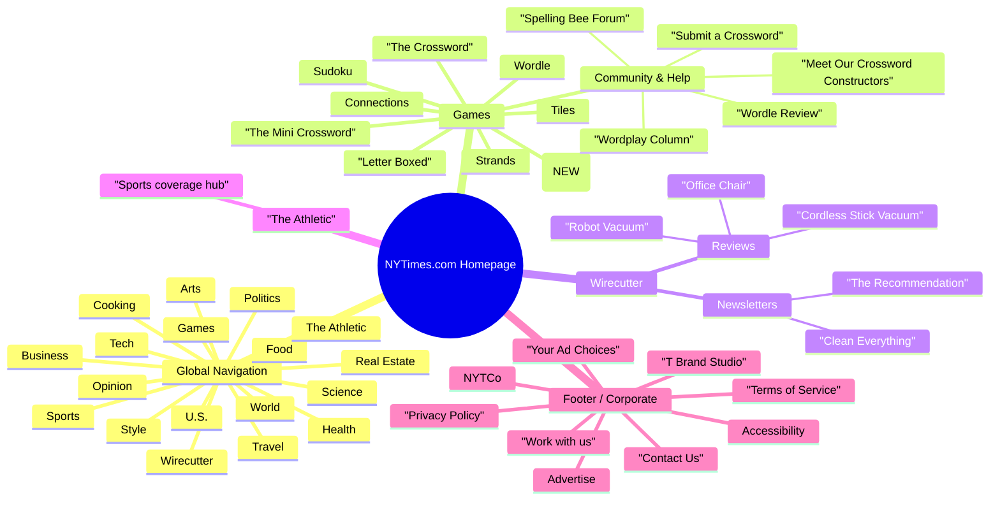

Global navigation & brands
==========================

*   Top-level nav item: **Games** with dropdown submenu \[Verified\].
    The New York Times - Breaking N…
*   Top-level nav item: **Wirecutter** with dropdown submenu \[Verified\].
*   Top-level nav item: **The Athletic** with dropdown submenu container present (menu content truncated in file) \[Verified (existence), details Assumed/Unverified\].
    The New York Times - Breaking N…
*   Brand family represented in structured data: **NYT Cooking**, **Wirecutter**, **The Athletic** as `subOrganization` of NYT \[Verified\].
*   Other section tabs (e.g., World, U.S., Politics, Business, Opinion, etc.) \[Assumed/Unverified\] (not visible in provided slices).

Games submenu (multi-column)
============================

**Primary game links**

*   Wordle \[Verified\].
    The New York Times - Breaking N…
*   The Crossword (Daily) \[Verified\].
    The New York Times - Breaking N…
*   **Pips** (labeled “NEW”) \[Verified\].
    The New York Times - Breaking N…
*   Strands \[Verified\].
*   Connections \[Verified\].
*   Sudoku \[Verified\].
*   Letter Boxed \[Verified\].
*   Tiles \[Verified\].

**Games → Community column**

*   Spelling Bee Forum \[Verified\].
    The New York Times - Breaking N…
*   Wordplay Column \[Verified\].
    The New York Times - Breaking N…
*   Wordle Review \[Verified\].
    The New York Times - Breaking N…
*   Submit a Crossword \[Verified\].
    The New York Times - Breaking N…
*   Meet Our Crossword Constructors \[Verified\].
    The New York Times - Breaking N…
*   “Mini to Maestro” series \[Verified\].
    The New York Times - Breaking N…
*   Wordlebot interactive \[Verified\].
    The New York Times - Breaking N…

**Games promo metadata (hero/cards copy in JSON)**

*   Wordle — “Guess the 5-letter word with 6 chances.” \[Verified\].
    The New York Times - Breaking N…
*   Connections — “Group words that share a common thread.” \[Verified\].
    The New York Times - Breaking N…
*   Pips — “Place every domino in the right spot.” \[Verified\].
    The New York Times - Breaking N…
*   Spelling Bee — “How many words can you make with 7 letters?” \[Verified\].
    The New York Times - Breaking N…
*   The Crossword — “Get clued in with wordplay, every day.” \[Verified\].
    The New York Times - Breaking N…

Wirecutter submenu
==================

**Popular review targets**

*   Cordless Stick Vacuum \[Verified\].
    The New York Times - Breaking N…
*   Office Chair \[Verified\].
    The New York Times - Breaking N…
*   Robot Vacuum \[Verified\].
    The New York Times - Breaking N…

**Newsletters (linked from Wirecutter area)**

*   The Recommendation (logo, description) \[Verified\].
    The New York Times - Breaking N…
*   Clean Everything (logo, description) \[Verified\].
    The New York Times - Breaking N…
*   “See all newsletters” link \[Verified\].
    The New York Times - Breaking N…

**Subscription note**

*   “Wirecutter is included in an All Access subscription.” (inline copy + learn more link) \[Verified\].
    The New York Times - Breaking N…

The Athletic submenu
====================

*   Dropdown wrapper & aria labels present; specific link items not visible in shared slices \[Verified (menu container), items Assumed/Unverified\].
    The New York Times - Breaking N…

Structured data (JSON-LD) that shapes the homepage
==================================================

*   `WebSite.mainEntity` lists **35** item URLs (positions 1–35), including Games entries such as Wordle, Connections, Spelling Bee, Crosswords, Mini, and other content cards \[Verified\].
    The New York Times - Breaking N…

Site index & footer
===================

*   **Site Index** nav present: `<nav id="site-index" aria-labelledby="site-index-label">` \[Verified\].
    The New York Times - Breaking N…
*   **Footer → Site Information Navigation** (corporate/help links) including:
    *   NYTCo, Contact Us, Accessibility, Work with us, Advertise, T Brand Studio, Your Ad Choices \[Verified\].
        The New York Times - Breaking N…
    *   Copyright line: “© 2025 The New York Times Company” \[Verified\].
        The New York Times - Breaking N…

Other modules & utilities
=========================

*   **Most Popular** appears as a Windows “site task” meta link (not necessarily a visible module on this HTML snapshot) \[Verified (meta link), module presence Assumed/Unverified\].
    The New York Times - Breaking N…
*   **Search / Account** controls \[Assumed/Unverified\] (not visible in slices).
*   **Breaking news banner** \[Assumed/Unverified\].
*   **Live coverage modules** \[Assumed/Unverified\].
*   **Personalized carousels**: JSON shows `isPersonalized: true` on some home packages (e.g., Cooking/Wirecutter add-ons), implying personalized placements \[Verified (presence of personalization flags), specific UI Assumed/Unverified\].

* * *

Inconsistencies vs. our prior IA (flagged)
------------------------------------------

*   **“Breaking News Banner”** — listed in the earlier IA as a common element; **not evidenced** in the provided HTML snapshot → treat as conditional, not guaranteed. \[Assumed/Unverified\]
*   **“Live Coverage” modules** — also mentioned earlier as typical; **not evidenced** here. \[Assumed/Unverified\]
*   **Section-wide header tabs (World/U.S./Politics/… )** — typical in IA, but **not visible** in the captured slices; could be outside the captured region or changed by A/B or viewport. \[Assumed/Unverified\]
*   **“Most Popular/Trending” list** — earlier IA mentions a list; the HTML only shows a **meta “Most Popular” app task** (Windows) but **no visible homepage list** in the captured content. \[Meta link Verified; module presence Assumed/Unverified\].
    The New York Times - Breaking N…

# Main sections (H1)

## Global Navigation

### Subsections (H2)

* World
* U.S.
* Politics
* Business
* Opinion
* Tech
* Science
* Health
* Sports
* Arts
* Travel
* Style
* Real Estate
* Food
* Cooking
* Wirecutter
* The Athletic
* Games

## Games

### Subsections (H2)

* Wordle
* The Mini Crossword
* The Crossword
* Pips (NEW)
* Strands
* Connections
* Sudoku
* Letter Boxed
* Tiles

### Tertiary categories (H3) — Community & Help

* Spelling Bee Forum
* Wordplay Column
* Wordle Review
* Submit a Crossword
* Meet Our Crossword Constructors

## Wirecutter

### Subsections (H2)

* Cordless Stick Vacuum (review)
* Office Chair (review)
* Robot Vacuum (review)

### Tertiary categories (H3) — Newsletters

* The Recommendation — “The best independent reviews, expert advice and intensively researched deals.”
* Clean Everything — “Step-by-step advice on how to keep everything in your home squeaky clean.”

## The Athletic

### Subsections (H2)

* (Homepage / hub link to personalized sports coverage)

## Footer / Corporate

### Subsections (H2)

* NYTCo
* Contact Us
* Accessibility
* Work with us
* Advertise
* T Brand Studio
* Your Ad Choices
* Privacy Policy
* Terms of Service

---

## Text-based diagram (Mermaid)

**Why this format?** Mermaid’s mindmap is a clear, compact way to show parent–child hierarchy (H1→H2→H3) without extra styling. It keeps relationships obvious, is easy to scan, and remains faithful to the extracted structure from the HTML. If you’d prefer, I can also provide an ASCII tree or a nested Markdown list version for environments that don’t render Mermaid.
