U.S.
====

**Sections**

*   U.S. **\[Verified\]**
*   Politics **\[Verified\]**
*   New York **\[Verified\]**
*   California **\[Verified\]**
*   Education **\[Verified\]**
*   Health **\[Verified\]**
*   Obituaries **\[Verified\]**
*   Science **\[Verified\]**
*   Climate **\[Verified\]**
*   Weather **\[Verified\]**
*   Sports **\[Verified\]**
*   Business **\[Verified\]**
*   Tech **\[Verified\]**
*   The Upshot **\[Verified\]**
*   The Magazine **\[Verified\]**

**Top Stories**

*   Donald Trump **\[Verified\]**
*   Supreme Court **\[Verified\]**
*   Congress **\[Verified\]**
*   Immigration **\[Verified\]**
*   Abortion **\[Verified\]**

**Newsletters**

*   The Morning **\[Verified\]**
*   The Evening **\[Verified\]**
*   “See all newsletters” link **\[Verified\]**

**Podcasts**

*   The Daily **\[Verified\]**
*   “See all podcasts” link **\[Verified\]**

* * *

World
=====

**Sections**

*   World **\[Verified\]**
*   Africa **\[Verified\]**
*   Americas **\[Verified\]**
*   Asia **\[Verified\]**
*   Australia **\[Verified\]**
*   Canada **\[Verified\]**
*   Europe **\[Verified\]**
*   Middle East **\[Verified\]**
*   Science **\[Verified\]**
*   Climate **\[Verified\]**
*   Health **\[Verified\]**
*   Obituaries **\[Verified\]**

**Top Stories**

*   Middle East Crisis **\[Verified\]**
*   Russia-Ukraine War **\[Verified\]**
*   China (International relations) **\[Verified\]**
*   The Global Profile **\[Verified\]**
*   Leer en Español **\[Verified\]**

**Newsletters**

*   Morning Briefing: Europe **\[Verified\]**
*   The Interpreter **\[Verified\]**
*   Your Places: Global Update **\[Verified\]**
*   Canada Letter **\[Verified\]**
*   “See all newsletters” link **\[Verified\]**

* * *

Business
========

**Sections**

*   Business **\[Verified\]**
*   Tech **\[Verified\]**
*   Economy **\[Verified\]**
*   Media **\[Verified\]**
*   Finance and Markets **\[Verified\]**

**Topics**

*   DealBook **\[Verified\]**
*   Personal Tech **\[Verified\]**
*   Energy Transition **\[Verified\]**
*   Your Money **\[Verified\]**

**Top Stories**

*   U.S. Economy **\[Verified\]**
*   Stock Market **\[Verified\]**
*   Artificial Intelligence **\[Verified\]**

**Newsletters**

*   DealBook **\[Verified\]**
*   On Tech **\[Verified\]**
*   “See all newsletters” link **\[Verified\]**

**Podcasts**

*   Hard Fork **\[Verified\]**
*   “See all podcasts” link **\[Verified\]**

* * *

Arts
====

**Sections**

*   Today’s Arts **\[Verified\]**
*   Book Review **\[Verified\]**
*   Best Sellers **\[Verified\]**
*   Dance **\[Verified\]**
*   Movies **\[Verified\]**
*   Music **\[Verified\]**
*   Television **\[Verified\]**
*   Theater **\[Verified\]**
*   Pop Culture **\[Verified\]**
*   T Magazine **\[Verified\]**
*   Visual Arts **\[Verified\]**

**Recommendations**

*   100 Best Movies of the 21st Century **\[Verified\]**
*   Critics Picks **\[Verified\]**
*   What to Read **\[Verified\]**
*   What to Watch **\[Verified\]**
*   What to Listen To **\[Verified\]**
*   5 Minutes to Make You Love Music **\[Verified\]**

**Newsletters**

*   Books **\[Verified\]**
*   Watching **\[Verified\]**
*   “See all newsletters” link **\[Verified\]**

**Podcasts**

*   Book Review **\[Verified\]**
*   Popcast **\[Verified\]**
*   “See all podcasts” link **\[Verified\]**

* * *

Lifestyle
=========

**Sections**

*   All Lifestyle **\[Verified\]**
*   Well **\[Verified\]**
*   Travel **\[Verified\]**
*   Style **\[Verified\]**
*   Real Estate **\[Verified\]**
*   Food **\[Verified\]**
*   Personal Tech **\[Verified\]**
*   T Magazine **\[Verified\]**

**Columns**

*   36 Hours **\[Verified\]**
*   Ask Well **\[Verified\]**
*   The Hunt **\[Verified\]**
*   Modern Love **\[Verified\]**
*   Where to Eat **\[Verified\]**
*   Social Q’s **\[Verified\]**
*   The Ethicist **\[Verified\]**
*   Ask the Therapist **\[Verified\]**

**Newsletters**

*   The Weekender **\[Verified\]**
*   Well **\[Verified\]**
*   “See all newsletters” link **\[Verified\]**

**Podcasts**

*   Modern Love **\[Verified\]**
*   “See all podcasts” link **\[Verified\]**

* * *

Opinion
=======

**Sections**

*   Opinion **\[Verified\]**
*   Guest Essays **\[Verified\]**
*   Editorials **\[Verified\]**
*   Op-Docs **\[Verified\]**
*   Videos **\[Verified\]**
*   Letters **\[Verified\]**

**Topics**

*   Politics **\[Verified\]**
*   World **\[Verified\]**
*   Business **\[Verified\]**
*   Tech **\[Verified\]**
*   Climate **\[Verified\]**
*   Health **\[Verified\]**
*   Culture **\[Verified\]**

**Columnists**

*   Jamelle Bouie **\[Verified\]**
*   David Brooks **\[Verified\]**
*   Gail Collins **\[Verified\]**
*   Maureen Dowd **\[Verified\]**
*   David French **\[Verified\]**
*   Thomas L. Friedman **\[Verified\]**
*   Michelle Goldberg **\[Verified\]**
*   Ezra Klein **\[Verified\]**
*   Nicholas Kristof **\[Verified\]**
*   Carlos Lozada **\[Verified\]**
*   Tressie McMillan Cottom **\[Verified\]**
*   Lydia Polgreen **\[Verified\]**
*   Bret Stephens **\[Verified\]**
*   Zeynep Tufekci **\[Verified\]**

**Podcasts**

*   Interesting Times with Ross Douthat **\[Verified\]**
*   The Opinions **\[Verified\]**
*   The Ezra Klein Show **\[Verified\]**
*   “See all podcasts” link **\[Verified\]**

* * *

Audio
=====

**Description**

*   Audio — “Podcasts and narrated articles…” **\[Verified\]**

**Listen**

*   The Headlines **\[Verified\]**
*   The Daily **\[Verified\]**
*   Hard Fork **\[Verified\]**
*   The Ezra Klein Show **\[Verified\]**
*   Interesting Times **\[Verified\]**
*   The Opinions **\[Verified\]**
*   Serial Productions **\[Verified\]**
*   The Book Review Podcast **\[Verified\]**
*   Modern Love **\[Verified\]**
*   Popcast **\[Verified\]**
*   Reporter Reads **\[Verified\]**
*   Cannonball **\[Verified\]**
*   The Interview **\[Verified\]**
*   “See all audio” link **\[Verified\]**

**Featured**

*   Cannonball with Wesley Morris **\[Verified\]**
*   The Headlines **\[Verified\]**
*   Serial: The Retrivals (season note) **\[Verified\]**

**Newsletters**

*   Audio **\[Verified\]**
*   Serial **\[Verified\]**
*   “See all newsletters” link **\[Verified\]**

* * *

Games
=====

**Description**

*   “Word games, logic puzzles and crosswords…” **\[Verified\]**

**Play**

*   Spelling Bee **\[Verified\]**
*   The Mini Crossword **\[Verified\]**
*   Wordle **\[Verified\]**
*   The Crossword **\[Verified\]**
*   Sudoku **\[Verified\]**
*   Letter Boxed **\[Verified\]**
*   Tiles **\[Verified\]**
*   Connections **\[Verified\]**

**Community**

*   Spelling Bee Forum **\[Verified\]**
*   Wordplay Column **\[Verified\]**
*   Wordle Review **\[Verified\]**
*   Submit a Crossword **\[Verified\]**
*   Meet Our Crossword Constructors **\[Verified\]**
*   Mini to Maestro **\[Verified\]**
*   Wordlebot **\[Verified\]**
*   Take the Puzzle Personality Quiz **\[Verified\]**

**Newsletters**

*   Gameplay **\[Verified\]**
*   Easy Mode **\[Verified\]**
*   “See all newsletters” link **\[Verified\]**

* * *

Cooking
=======

**Description**

*   “Recipes, advice and inspiration…” **\[Verified\]**

**Recipes**

*   Easy **\[Verified\]**
*   Dinner **\[Verified\]**
*   Quick **\[Verified\]**
*   Healthy **\[Verified\]**
*   Breakfast **\[Verified\]**
*   Vegetarian **\[Verified\]**
*   Vegan **\[Verified\]**
*   Chicken **\[Verified\]**
*   Pasta **\[Verified\]**
*   Dessert **\[Verified\]**

**Editors’ Picks**

*   Easy Salmon Recipes **\[Verified\]**
*   Grilling Recipes **\[Verified\]**
*   Easy Weeknight **\[Verified\]**
*   Newest Recipes **\[Verified\]**
*   Cheap and Easy Dinner Ideas **\[Verified\]**
*   Slow Cooker Recipes **\[Verified\]**
*   Healthy Breakfast Ideas **\[Verified\]**
*   Fourth of July Recipes **\[Verified\]**

**Newsletters**

*   The Cooking Newsletter **\[Verified\]**
*   Five Weeknight Dishes **\[Verified\]**
*   The Veggie **\[Verified\]**
*   “See all newsletters” link **\[Verified\]**

* * *

Wirecutter
==========

**Description**

*   “Reviews and recommendations for thousands of products.” **\[Verified\]**

**Reviews**

*   Kitchen **\[Verified\]**
*   Tech **\[Verified\]**
*   Sleep **\[Verified\]**
*   Appliances **\[Verified\]**
*   Home and Garden **\[Verified\]**
*   Moving **\[Verified\]**
*   Travel **\[Verified\]**
*   Gifts **\[Verified\]**
*   Baby and Kid **\[Verified\]**
*   Health and Fitness **\[Verified\]**

**The Best…**

*   Air Purifier **\[Verified\]**
*   Electric Toothbrush **\[Verified\]**
*   Pressure Washer **\[Verified\]**
*   Cordless Stick Vacuum **\[Verified\]**
*   Office Chair **\[Verified\]**
*   Robot Vacuum **\[Verified\]**

**Newsletters**

*   The Recommendation **\[Verified\]**
*   Clean Everything **\[Verified\]**
*   “See all newsletters” link **\[Verified\]**

* * *

Inconsistencies vs. your earlier IA summary
-------------------------------------------

*   None detected. The flyout menus reinforce the earlier high-level IA: global sections at the top; each flyout groups **Sections / Topics (or Top Stories) / Newsletters / Podcasts (or Community/Featured)**. **\[Verified\]**

# 📑 Structured Information Architecture

## U.S.

### Subsections

* Politics
* New York
* California
* Education
* Health
* Obituaries
* Science
* Climate
* Weather
* Sports
* Business
* Tech
* The Upshot
* The Magazine

### Tertiary

* **Top Stories**: Donald Trump, Supreme Court, Congress, Immigration, Abortion
* **Newsletters**: The Morning, The Evening
* **Podcasts**: The Daily

---

## World

### Subsections

* Africa
* Americas
* Asia
* Australia
* Canada
* Europe
* Middle East
* Science
* Climate
* Health
* Obituaries

### Tertiary

* **Top Stories**: Middle East Crisis, Russia-Ukraine War, China International Relations, The Global Profile, Leer en Español
* **Newsletters**: Morning Briefing: Europe, The Interpreter, Your Places: Global Update, Canada Letter

---

## Business

### Subsections

* Economy
* Media
* Tech
* Finance and Markets

### Tertiary

* **Topics**: DealBook, Personal Tech, Energy Transition, Your Money
* **Top Stories**: U.S. Economy, Stock Market, Artificial Intelligence
* **Newsletters**: DealBook, On Tech
* **Podcasts**: Hard Fork

---

## Arts

### Subsections

* Today’s Arts
* Book Review
* Best Sellers
* Dance
* Movies
* Music
* Television
* Theater
* Pop Culture
* T Magazine
* Visual Arts

### Tertiary

* **Recommendations**: 100 Best Movies, Critics Picks, What to Read, What to Watch, What to Listen To, 5 Minutes to Make You Love Music
* **Newsletters**: Books, Watching
* **Podcasts**: Book Review, Popcast

---

## Lifestyle

### Subsections

* All Lifestyle
* Well
* Travel
* Style
* Real Estate
* Food
* Personal Tech
* T Magazine

### Tertiary

* **Columns**: 36 Hours, Ask Well, The Hunt, Modern Love, Where to Eat, Social Q’s, The Ethicist, Ask the Therapist
* **Newsletters**: The Weekender, Well
* **Podcasts**: Modern Love

---

## Opinion

### Subsections

* Opinion
* Guest Essays
* Editorials
* Op-Docs
* Videos
* Letters

### Tertiary

* **Topics**: Politics, World, Business, Tech, Climate, Health, Culture
* **Columnists**: Jamelle Bouie, David Brooks, Gail Collins, Maureen Dowd, David French, Thomas L. Friedman, Michelle Goldberg, Ezra Klein, Nicholas Kristof, Carlos Lozada, Tressie McMillan Cottom, Lydia Polgreen, Bret Stephens, Zeynep Tufekci
* **Podcasts**: Interesting Times (Ross Douthat), The Opinions, The Ezra Klein Show

---

## Audio

### Subsections

* Audio (general hub)

### Tertiary

* **Listen**: The Headlines, The Daily, Hard Fork, The Ezra Klein Show, Interesting Times, The Opinions, Serial Productions, The Book Review Podcast, Modern Love, Popcast, Reporter Reads, Cannonball, The Interview
* **Featured**: Cannonball with Wesley Morris, The Headlines, Serial: The Retrivals
* **Newsletters**: Audio, Serial

---

## Games

### Subsections

* Games (general hub)

### Tertiary

* **Play**: Spelling Bee, Mini Crossword, Wordle, Crossword, Sudoku, Letter Boxed, Tiles, Connections
* **Community**: Spelling Bee Forum, Wordplay Column, Wordle Review, Submit a Crossword, Meet Our Constructors, Mini to Maestro, Wordlebot, Puzzle Personality Quiz
* **Newsletters**: Gameplay, Easy Mode

---

## Cooking

### Subsections

* Cooking (general hub)

### Tertiary

* **Recipes**: Easy, Dinner, Quick, Healthy, Breakfast, Vegetarian, Vegan, Chicken, Pasta, Dessert
* **Editors’ Picks**: Easy Salmon Recipes, Grilling Recipes, Easy Weeknight, Newest Recipes, Cheap & Easy Dinner Ideas, Slow Cooker Recipes, Healthy Breakfast Ideas, Fourth of July Recipes
* **Newsletters**: Cooking Newsletter, Five Weeknight Dishes, The Veggie

---

## Wirecutter

### Subsections

* Wirecutter (general hub)

### Tertiary

* **Reviews**: Kitchen, Tech, Sleep, Appliances, Home & Garden, Moving, Travel, Gifts, Baby & Kid, Health & Fitness
* **The Best…**: Air Purifier, Electric Toothbrush, Pressure Washer, Cordless Stick Vacuum, Office Chair, Robot Vacuum
* **Newsletters**: The Recommendation, Clean Everything

---

# 📊 Visualization (Mermaid Diagram)

I’ll use **Mermaid** because it’s supported here, clean, and allows hierarchical visualization in a readable tree.

```mermaid
mindmap
  root((NYT Homepage Navigation))
    U.S.
      Subsections
        Politics
        New York
        California
        Education
        Health
        Obituaries
        Science
        Climate
        Weather
        Sports
        Business
        Tech
        The Upshot
        The Magazine
      Top Stories
        Donald Trump
        Supreme Court
        Congress
        Immigration
        Abortion
      Newsletters
        The Morning
        The Evening
      Podcasts
        The Daily
    World
      Subsections
        Africa
        Americas
        Asia
        Australia
        Canada
        Europe
        Middle East
        Science
        Climate
        Health
        Obituaries
      Top Stories
        Middle East Crisis
        Russia-Ukraine War
        China Relations
        The Global Profile
        Leer en Español
      Newsletters
        Morning Briefing: Europe
        The Interpreter
        Your Places: Global Update
        Canada Letter
    Business
      Subsections
        Economy
        Media
        Tech
        Finance and Markets
      Topics
        DealBook
        Personal Tech
        Energy Transition
        Your Money
      Top Stories
        U.S. Economy
        Stock Market
        AI
      Newsletters
        DealBook
        On Tech
      Podcasts
        Hard Fork
    Arts
      Subsections
        Today's Arts
        Book Review
        Best Sellers
        Dance
        Movies
        Music
        Television
        Theater
        Pop Culture
        T Magazine
        Visual Arts
      Recommendations
        100 Best Movies
        Critics Picks
        What to Read
        What to Watch
        What to Listen To
        5 Min Love Music
      Newsletters
        Books
        Watching
      Podcasts
        Book Review
        Popcast
    Lifestyle
      Subsections
        All Lifestyle
        Well
        Travel
        Style
        Real Estate
        Food
        Personal Tech
        T Magazine
      Columns
        36 Hours
        Ask Well
        The Hunt
        Modern Love
        Where to Eat
        Social Q's
        The Ethicist
        Ask the Therapist
      Newsletters
        The Weekender
        Well
      Podcasts
        Modern Love
    Opinion
      Subsections
        Opinion
        Guest Essays
        Editorials
        Op-Docs
        Videos
        Letters
      Topics
        Politics
        World
        Business
        Tech
        Climate
        Health
        Culture
      Columnists
        Jamelle Bouie
        David Brooks
        Gail Collins
        Maureen Dowd
        David French
        Thomas L. Friedman
        Michelle Goldberg
        Ezra Klein
        Nicholas Kristof
        Carlos Lozada
        Tressie McMillan Cottom
        Lydia Polgreen
        Bret Stephens
        Zeynep Tufekci
      Podcasts
        Interesting Times
        The Opinions
        Ezra Klein Show
    Audio
      Listen
        The Headlines
        The Daily
        Hard Fork
        Ezra Klein Show
        Interesting Times
        The Opinions
        Serial Productions
        Book Review Podcast
        Modern Love
        Popcast
        Reporter Reads
        Cannonball
        The Interview
      Featured
        Cannonball w/ Wesley Morris
        The Headlines
        Serial: The Retrivals
      Newsletters
        Audio
        Serial
    Games
      Play
        Spelling Bee
        Mini Crossword
        Wordle
        Crossword
        Sudoku
        Letter Boxed
        Tiles
        Connections
      Community
        Spelling Bee Forum
        Wordplay Column
        Wordle Review
        Submit Crossword
        Meet Constructors
        Mini to Maestro
        Wordlebot
        Puzzle Personality Quiz
      Newsletters
        Gameplay
        Easy Mode
    Cooking
      Recipes
        Easy
        Dinner
        Quick
        Healthy
        Breakfast
        Vegetarian
        Vegan
        Chicken
        Pasta
        Dessert
      Editors' Picks
        Salmon Recipes
        Grilling Recipes
        Easy Weeknight
        Newest Recipes
        Cheap & Easy Dinner
        Slow Cooker Recipes
        Healthy Breakfast
        Fourth of July Recipes
      Newsletters
        Cooking Newsletter
        Five Weeknight Dishes
        The Veggie
    Wirecutter
      Reviews
        Kitchen
        Tech
        Sleep
        Appliances
        Home & Garden
        Moving
        Travel
        Gifts
        Baby & Kid
        Health & Fitness
      The Best
        Air Purifier
        Electric Toothbrush
        Pressure Washer
        Cordless Vacuum
        Office Chair
        Robot Vacuum
      Newsletters
        The Recommendation
        Clean Everything
```

---

✅ **Why Mermaid?**
I chose **Mermaid mindmap** because it clearly shows parent-child relationships in a **collapsible hierarchy**. It’s more readable than ASCII trees for this many nodes, and it matches the structured nature of NYT’s IA.