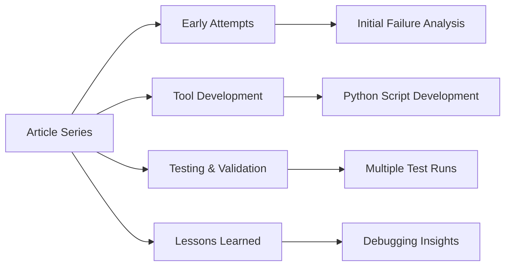

# The Count That Couldn't: AI Writing Analysis Tool Development

*Building transparent measurement tools for AI vs. human contribution in collaborative writing.*

## Article Overview



This article series documents the process of building tools to measure and visualize the balance between AI-generated and human-contributed content in collaborative writing. The project explores both the technical challenges of text analysis and the deeper questions about transparency in AI-assisted work.

## Research Question

**Core Question**: How can we transparently measure AI vs. human contribution in collaborative writing processes?

**Sub-questions**:
- What metrics best capture the collaborative writing process?
- How do iterative edits change the AI/human balance?
- What insights emerge from failed attempts at tool building?
- How can we make AI collaboration more transparent and accountable?

## Article Structure

### Progressive Drafts
| Version | Focus | Status | Key Insights |
|---------|-------|--------|--------------|
| **[raw/01-the-count-that-coudnt.md](./raw/01-the-count-that-coudnt.md)** | Early attempts and failures | Draft | Initial tool building challenges |
| **[raw/02-the-count-that-coudnt.md](./raw/02-the-count-that-coudnt.md)** | Refined approach | Draft | Improved methodology |
| **[raw/03-the-count-that-coudnt.md](./raw/03-the-count-that-coudnt.md)** | Testing and validation | Draft | Real-world testing results |
| **[raw/04-the-count-that-coudnt.md](./raw/04-the-count-that-coudnt.md)** | Final analysis | Draft | Comprehensive findings |

### Supporting Materials

#### Analysis Scripts
- **[0510-generate-data.py](./0510-generate-data.py)** - Primary data generation script
- **[0513-compare-data.py](./0513-compare-data.py)** - Comparative analysis tool

#### Research Documentation
- **[0510-ai_script_reflection_full_with_appendix.md](./0510-ai_script_reflection_full_with_appendix.md)** - Complete reflection on AI-assisted development
- **[0510-chatgpt-ai-script-debugging-analysis.md](./0510-chatgpt-ai-script-debugging-analysis.md)** - Debugging session analysis
- **[0513-chatgpt-human-contribution-metrics-charts.md](./0513-chatgpt-human-contribution-metrics-charts.md)** - Metrics and visualization development

#### Test Results
- **[script-test-1/](./script-test-1/)** - First experimental run
- **[script-test-2/](./script-test-2/)** - Second iteration with improvements
- **[script-test-3/](./script-test-3/)** - Final validation testing

Each test directory contains:
- CSV data exports with analysis metrics
- Generated charts showing human vs. AI contribution
- ChatGPT interaction logs documenting the analysis process
- ZIP archives of visualization outputs

## Key Findings

### Technical Insights
- **Tool Development Challenges**: Building reliable AI/human contribution measurement tools requires iterative refinement
- **Metrics Complexity**: Simple word counts and similarity measures provide limited insight into collaborative processes
- **Debugging Importance**: Failed attempts provide valuable learning about both tools and methodology

### Process Insights
- **Transparency Benefits**: Documenting failures alongside successes improves research quality
- **Iterative Development**: Multiple test cycles revealed tool limitations and improvement opportunities
- **Human-AI Balance**: Understanding contribution requires both quantitative metrics and qualitative analysis

### Methodological Insights
- **Script Testing**: Multiple test runs with different data revealed tool robustness issues
- **Prompt Engineering**: Effective AI collaboration requires careful prompt design and iteration
- **Documentation Standards**: Comprehensive process documentation enables replication and improvement

## Research Methodology

### Tool Development Approach
1. **Initial Conceptualization**: Define transparent measurement goals
2. **Rapid Prototyping**: Build minimum viable analysis tools
3. **Iterative Testing**: Run multiple test cycles with real data
4. **Failure Analysis**: Document unsuccessful approaches for learning
5. **Refinement**: Improve tools based on testing insights

### Analysis Techniques
- **Text Similarity Metrics**: Cosine similarity, TF-IDF analysis
- **Statistical Measures**: Word counts, readability scores, transformation ratios
- **Visualization**: Charts showing contribution balance over time
- **Qualitative Review**: Human assessment of quantitative results

### Documentation Standards
- **Process Transparency**: All AI interactions documented
- **Code Preservation**: Scripts maintained with original parameters
- **Result Archiving**: All test outputs preserved for comparison
- **Failure Reporting**: Unsuccessful attempts included for learning

## Technical Requirements

### Python Dependencies
```python
# Core analysis libraries
pandas>=1.3.0
numpy>=1.21.0
scikit-learn>=1.0.0
matplotlib>=3.5.0

# Text processing
nltk>=3.7
textstat>=0.7.0
readability>=0.3.0

# Data export
csv (built-in)
json (built-in)
```

### Platform Requirements
- **Python 3.10+**
- **Jupyter Notebook** (optional, for interactive development)
- **Google Colab** (alternative platform for some analysis)

## Quick Start Guide

### Running Analysis Scripts

1. **Setup Environment**:
   ```bash
   pip install pandas numpy scikit-learn matplotlib nltk textstat
   ```

2. **Run Data Generation**:
   ```bash
   python 0510-generate-data.py
   ```

3. **Execute Comparative Analysis**:
   ```bash
   python 0513-compare-data.py
   ```

### Exploring Test Results

1. **Review Test Directories**: Start with `script-test-1/` for initial results
2. **Examine CSV Files**: Quantitative metrics in structured format
3. **View Charts**: Visualization outputs in ZIP archives
4. **Read Analysis Logs**: ChatGPT interaction documentation

### Replicating Analysis

1. **Use Original Scripts**: Preserved with original parameters
2. **Follow File Naming**: Scripts expect specific input file patterns
3. **Document Changes**: Any modifications for transparency
4. **Compare Results**: Validate against included test outputs

## Learning Outcomes

### For Researchers
- **Tool Development**: Practical experience building analysis utilities
- **Methodology Design**: Systematic approach to human-AI collaboration measurement
- **Failure Analysis**: Learning from unsuccessful attempts
- **Documentation Practice**: Comprehensive research process recording

### For Practitioners
- **Script Development**: Real-world Python analysis tool creation
- **Testing Approaches**: Multiple validation cycle methodology
- **AI Collaboration**: Effective prompt engineering for development tasks
- **Quality Assurance**: Debugging and validation techniques

### For Students
- **Research Process**: End-to-end tool development documentation
- **Technical Skills**: Python scripting for text analysis
- **Critical Thinking**: Understanding tool limitations and biases
- **Academic Writing**: Documenting technical project progressions

## Future Directions

### Tool Improvements
- **Enhanced Metrics**: More sophisticated contribution measurement
- **Real-time Analysis**: Live collaboration tracking capabilities
- **User Interface**: Simplified tool access for non-technical users
- **Integration**: Connection with existing writing platforms

### Research Extensions
- **Longitudinal Studies**: Tracking contribution patterns over time
- **Comparative Analysis**: Different AI models and collaboration styles
- **Domain-Specific Tools**: Specialized analysis for different writing types
- **Ethical Frameworks**: Guidelines for transparent AI collaboration

## Contributing

This research documents a specific tool development journey. While not actively seeking contributions, the materials are designed for:

- **Replication**: Scripts and data for reproducing analysis
- **Extension**: Building on documented methodology
- **Learning**: Understanding tool development challenges
- **Adaptation**: Modifying approach for different research questions

---

*This article series represents ongoing research into AI collaboration transparency. Tools and methods continue to evolve based on testing and community feedback.*

*Last updated: 2025-09-20*