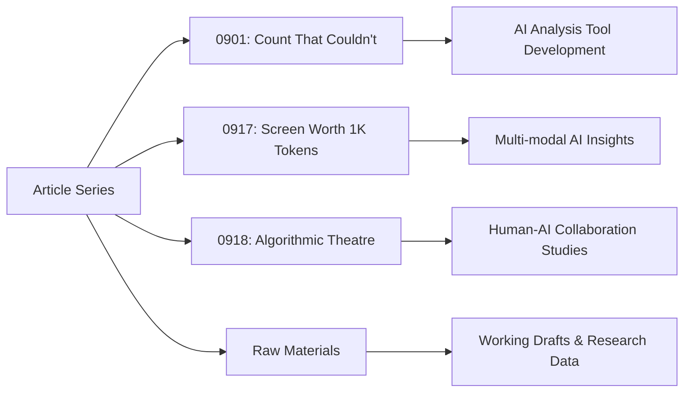

# Articles

*Current research articles exploring AI, technology, and human creativity.*

## Overview



This directory contains the primary research articles for the Syntax & Empathy project. Each article documents experiments, insights, and discoveries at the intersection of artificial intelligence and human creativity. Articles are organized by date using the format `MMDD-descriptive-name/`.

## Table of Contents

### Current Article Series

| Article | Focus Area | Status | Key Insights |
|---------|------------|--------|--------------|
| **[0901-count-that-couldnt](./0901-count-that-couldnt/)** | AI Writing Analysis Tools | Research Phase | Building transparent measurement tools for AI vs. human contribution |
| **[0917-screen-worth-1k-tokens](./0917-screen-worth-1k-tokens/)** | Multi-modal AI Workflows | Development | Exploring visual, audio, and text combinations in AI analysis |
| **[0918-algorithmic-theatre](./0918-algorithmic-theatre/)** | Human-AI Collaboration | Active Research | Examining performative aspects of AI-assisted creative work |

### Raw Materials & Working Papers

The **[`/raw`](./raw/)** subdirectory contains working materials, draft versions, and research artifacts that support the published articles. This includes:

- **Working drafts** at various stages of development
- **Research data** and analysis results
- **Collaborative experiments** with different AI models
- **Supporting code** and analysis scripts

## Article Structure

Each article directory follows a consistent organization pattern:

```
MMDD-article-name/
├── 01-draft-article.md          # Initial draft
├── 02-refined-article.md        # Second iteration
├── 03-final-article.md          # Publication version
├── raw/                         # Working materials
│   ├── 01-04-working-drafts.md  # Progressive versions
│   └── research-notes.md        # Supporting analysis
├── images/                      # Visual assets
├── script-test-N/              # Analysis experiments
├── *.py                        # Analysis scripts
├── *.csv                       # Data exports
└── *.md                        # Research documentation
```

## Research Methodology

### Progressive Disclosure Approach

Articles are structured to serve different reader needs:

1. **Summary level**: Key insights and conclusions
2. **Methodology level**: Experimental approach and tools
3. **Implementation level**: Detailed code, data, and replication instructions
4. **Raw materials level**: Complete research artifacts and iterations

### Documentation Standards

- **Transparency**: All AI interactions and human modifications documented
- **Reproducibility**: Scripts and data preserved for replication
- **Iteration tracking**: Multiple draft versions show development process
- **Failure documentation**: Unsuccessful experiments included for learning

## Research Focus Areas

### AI Writing Analysis (0901 Series)
Developing tools to measure and visualize the balance between AI-generated and human-contributed content in collaborative writing processes.

**Key Research Questions:**
- How can we transparently measure AI vs. human contribution?
- What metrics best capture the collaborative writing process?
- How do different AI models affect the human-AI collaboration dynamic?

### Multi-modal AI Insights (0917 Series)
Exploring how combining visual, audio, and textual elements enhances AI-assisted analysis and content creation.

**Key Research Questions:**
- How do visual elements change AI text analysis capabilities?
- What workflows best integrate multiple modalities?
- How can multi-modal approaches improve research transparency?

### Algorithmic Theatre (0918 Series)
Examining the performative and theatrical aspects of human-AI collaboration in creative and analytical work.

**Key Research Questions:**
- What roles do humans and AI play in collaborative creative processes?
- How do we maintain authenticity in AI-assisted work?
- What are the ethical implications of AI collaboration in creative fields?

## Quick Start Guides

### For Researchers
1. **Browse article summaries** to identify relevant research areas
2. **Review methodology sections** for experimental approaches
3. **Access raw materials** for detailed analysis and data
4. **Run analysis scripts** to replicate findings (Python 3.10+ required)

### For Practitioners
1. **Read key insights** from article conclusions
2. **Examine tool implementations** in Python scripts
3. **Study failure documentation** to avoid common pitfalls
4. **Adapt methodologies** for your own AI collaboration projects

### For Students
1. **Start with article overviews** to understand research context
2. **Follow draft progressions** to see how research evolves
3. **Study AI interaction examples** to learn prompt engineering
4. **Use supporting materials** for deeper technical understanding

## Technical Requirements

### Analysis Scripts
Most articles include Python analysis scripts requiring:
- **Python 3.10+**
- **Standard libraries**: pandas, numpy, matplotlib, scikit-learn
- **Jupyter notebooks**: Some analysis designed for Google Colab
- **Text processing**: nltk, textstat, readability libraries

### Replication Notes
- File paths in scripts assume specific directory structures
- Some analysis requires original data files (preserved in article directories)
- Jupyter notebooks include detailed setup instructions
- Google Colab integration documented where applicable

## Contributing

While this is primarily a research documentation project, the methodologies and tools are designed to be:

- **Replicable**: Clear documentation and preserved analysis scripts
- **Extensible**: Modular approaches that can be adapted
- **Educational**: Detailed process documentation for learning

**For replication:**
1. Note specific dependencies in individual article directories
2. Preserve file naming conventions when adapting scripts
3. Review raw materials for complete context
4. Contact authors for clarification on complex analyses

## Navigation Tips

- **Start broad**: Read article summaries before diving into details
- **Follow progressions**: Numbered files show chronological development
- **Use raw materials**: Most detailed analysis in `/raw` subdirectories
- **Check supporting files**: Python scripts often contain additional insights
- **Reference archive**: Historical context available in `/archive` directory

---

*For questions about specific articles or methodologies, refer to individual article documentation or contact the research team.*

*Last updated: 2025-09-20*