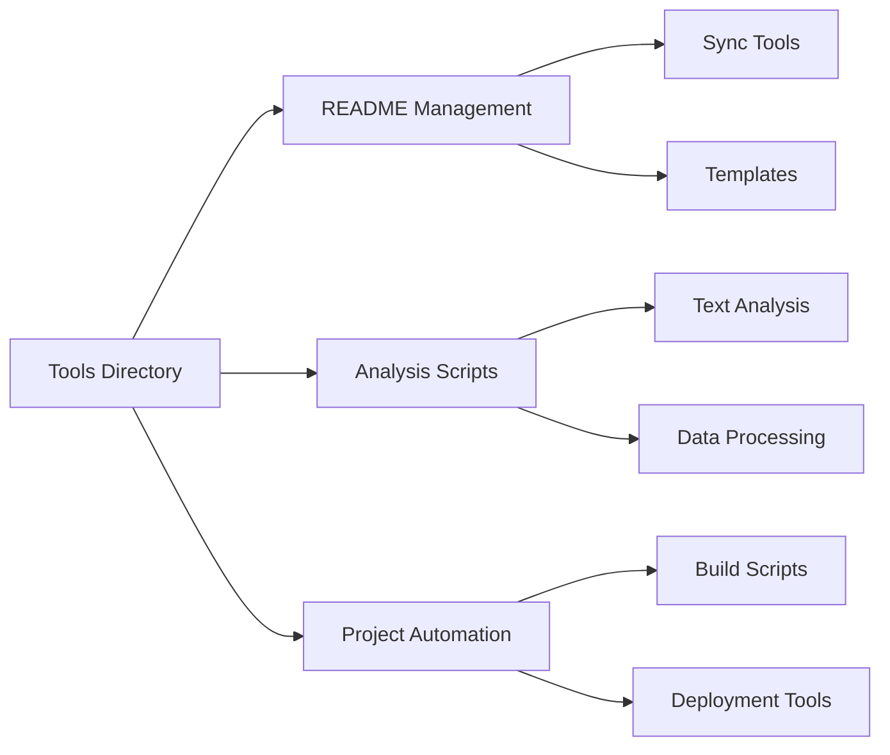

# Project Tools & Utilities

*Automation scripts and analysis utilities supporting the Syntax & Empathy research project.*

## Overview



This directory contains the tools and utilities that support the research, documentation, and publication processes for the Syntax & Empathy project. These tools help maintain consistency, automate repetitive tasks, and provide reusable components for analysis work.

## Tool Categories

### README Management
- **[readme/](./readme/)** - Comprehensive README generation and synchronization tools

### Analysis Utilities
- **Text Processing Scripts** - Utilities for analyzing AI vs. human writing contributions
- **Data Export Tools** - Scripts for generating CSV/JSON analysis results
- **Visualization Helpers** - Chart generation and formatting utilities

### Media Optimization
- **[compress_images.py](./compress_images.py)** - Image compression tool for reducing repository size

### Project Automation
- **Build Scripts** - Quarto site generation and deployment
- **File Organization** - Directory structure maintenance and validation
- **Documentation Sync** - Keeping documentation up-to-date across the project

## Featured Tools

### README Sync System
The README sync system maintains consistent, high-quality documentation across all project directories. It uses templates and automation to ensure documentation standards while preserving individual directory context.

**Key Components:**
- **[readme_sync.py](./readme/readme_sync.py)** - Main synchronization script
- **[readme_template.md](./readme/readme_template.md)** - Base template for README generation
- **[gemini_prompt.md](./readme/gemini_prompt.md)** - AI prompt template for documentation

### Image Compression Tool
Smart image compression utility that reduces repository size while maintaining visual quality. Automatically converts PNG to JPEG when transparency isn't needed and creates safety backups.

**Key Features:**
- **Smart format conversion** - Preserves transparency, optimizes file types
- **Quality control** - Adjustable compression settings
- **Safety backups** - Creates `.original` files before compression
- **Batch processing** - Handles entire directory trees
- **Dry run mode** - Preview changes before applying

**Quick Start:**
```bash
# See what would be compressed
python compress_images.py --dry-run

# Compress with default settings
python compress_images.py

# Custom settings for high-quality images
python compress_images.py --quality 90 --size-threshold 2
```

## Usage Guidelines

### For Researchers
1. **Use analysis utilities** to process text data consistently
2. **Run README sync** before major commits to maintain documentation
3. **Adapt templates** for new research areas while preserving standards
4. **Document custom tools** following established patterns

### For Contributors
1. **Check tool dependencies** before running scripts
2. **Follow naming conventions** for new utilities
3. **Test thoroughly** before committing changes
4. **Update documentation** when modifying existing tools

### For System Administration
1. **Monitor tool performance** and update dependencies
2. **Validate automation results** before deploying
3. **Backup critical utilities** and configuration files
4. **Document environment requirements** for reproducibility

## Technical Requirements

### Standard Dependencies
```python
# Core utilities
python>=3.10
pyyaml>=6.0
pathlib (built-in)
argparse (built-in)

# Text processing
pandas>=1.3.0
numpy>=1.21.0

# Image processing
pillow>=11.0.0

# File operations
shutil (built-in)
glob (built-in)
```

### Platform Requirements
- **Unix-like environment** (macOS, Linux) for shell scripts
- **Python 3.10+** for all Python utilities
- **Git** for version control integration
- **Quarto CLI** for site building tools

## Development Standards

### Code Quality
- **Type hints** for all function parameters and returns
- **Docstrings** for all public functions and classes
- **Error handling** for file operations and external dependencies
- **Logging** for debugging and monitoring

### Documentation Standards
- **Clear usage examples** for all utilities
- **Dependency specifications** with version requirements
- **Input/output descriptions** for data processing tools
- **Integration notes** for project workflow tools

### Testing Approach
- **Dry-run modes** for potentially destructive operations
- **Validation checks** before file modifications
- **Backup strategies** for critical operations
- **Rollback procedures** for automation failures

## Tool Reference

### README Management
```bash
# Sync all READMEs with latest templates
./readme_sync.py --mode full

# Update specific directories
./readme_sync.py --paths articles/ archive/

# Preview changes before applying
./readme_sync.py --preview
```

### Media Optimization
```bash
# Preview what images would be compressed (dry run)
python compress_images.py --dry-run

# Compress images with default settings (quality=85, threshold=1MB)
python compress_images.py

# Custom compression settings
python compress_images.py --quality 90 --size-threshold 2 --directory ../articles

# Compress specific directory
python compress_images.py --directory ../articles/0900-ai-lies
```

### Analysis Scripts
Most analysis tools follow this pattern:
```python
# Import analysis utilities
from tools.analysis import TextProcessor, MetricsCalculator

# Process input files
processor = TextProcessor(input_dir="articles/")
metrics = processor.calculate_ai_human_metrics()

# Export results
metrics.to_csv("analysis_results.csv")
```

### Project Automation
```bash
# Build and preview site
quarto preview

# Deploy to GitHub Pages
quarto publish gh-pages

# Validate project structure
python tools/validate_structure.py
```

## Best Practices

### Script Development
1. **Design for reusability** - Create modular, configurable tools
2. **Handle errors gracefully** - Provide clear error messages and recovery options
3. **Document thoroughly** - Include usage examples and edge cases
4. **Test extensively** - Validate with real project data before deployment

### Automation Usage
1. **Review changes** before committing automated updates
2. **Backup critical files** before running destructive operations
3. **Monitor results** to ensure automation meets expectations
4. **Update tools** as project requirements evolve

### Integration Workflow
1. **Run tools locally** before pushing changes
2. **Validate outputs** against project standards
3. **Document customizations** for future reference
4. **Share improvements** with the project team

## Contributing

### Adding New Tools
1. **Follow naming conventions** (`verb_noun.py` format)
2. **Include comprehensive documentation** with usage examples
3. **Add appropriate error handling** and logging
4. **Test with project data** before committing

### Improving Existing Tools
1. **Preserve backward compatibility** when possible
2. **Document breaking changes** clearly
3. **Update dependent workflows** when modifying interfaces
4. **Maintain test coverage** for modified functionality

---

*These tools support the ongoing research and publication workflow for Syntax & Empathy. They continue to evolve based on project needs and community feedback.*

*Last updated: 2025-09-20*
